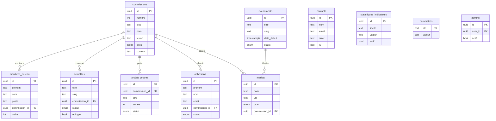

# Plan d'Implémentation — Plateforme Numérique CCJP
### Conseil Consultatif des Jeunes de Podor

> **Document d'exécution.** Ce plan opérationnalise le
> [Cahier des Charges officiel](./docs/cahier-des-charges-ccjp.md) (v1.0, 2025).
> Il apporte ce que le cahier des charges ne contient pas : le schéma SQL complet
> et exécutable, les politiques RLS détaillées, le découpage des tâches avec
> critères d'acceptation, la méthode de travail sur Google Antigravity, et les
> corrections de sécurité à appliquer.

| | |
|---|---|
| **Projet** | Plateforme Numérique Officielle du CCJP — ccjp-podor.sn |
| **Stack** | Next.js 14 (App Router) · Supabase · Tailwind CSS · Vercel |
| **Langage** | TypeScript |
| **Territoire** | Commune de Podor, région de Saint-Louis, Sénégal |
| **Mandat** | Programme Triennal 2026–2029 |
| **Commissions** | 14 commissions techniques |
| **Devise** | Écoute · Participation · Impact |
| **Délai** | 5 semaines (35 jours ouvrables) |
| **Version du plan** | 2.0 — alignée sur le cahier des charges v1.0 |
| **Date** | 30 septembre 2026 |

---

## Table des matières

1. [Contexte et cadre de référence](#1-contexte-et-cadre-de-référence)
2. [Périmètre fonctionnel](#2-périmètre-fonctionnel)
3. [Architecture technique](#3-architecture-technique)
4. [Charte graphique](#4-charte-graphique)
5. [Arborescence du projet](#5-arborescence-du-projet)
6. [Modèle de données Supabase](#6-modèle-de-données-supabase)
7. [Sécurité, RLS et authentification](#7-sécurité-rls-et-authentification)
8. [Les 14 commissions](#8-les-14-commissions)
9. [Pages publiques](#9-pages-publiques)
10. [Espace d'administration](#10-espace-dadministration)
11. [Plan d'implémentation par phases](#11-plan-dimplémentation-par-phases)
12. [Planning de développement](#12-planning-de-développement)
13. [Performance, SEO et accessibilité](#13-performance-seo-et-accessibilité)
14. [Variables d'environnement et dépendances](#14-variables-denvironnement-et-dépendances)
15. [Déploiement Vercel et CI/CD](#15-déploiement-vercel-et-cicd)
16. [Recette et checklist de mise en production](#16-recette-et-checklist-de-mise-en-production)
17. [Méthode d'exécution sur Google Antigravity](#17-méthode-dexécution-sur-google-antigravity)
18. [Écarts, alertes et recommandations](#18-écarts-alertes-et-recommandations)
19. [Évolutions futures — Phase 2](#19-évolutions-futures--phase-2)
20. [Annexes](#20-annexes)

---

## 1. Contexte et cadre de référence

### 1.1 Le CCJP

Le **Conseil Consultatif des Jeunes de Podor (CCJP)** est un cadre institutionnel
de concertation, de proposition et d'action au service de la jeunesse de la
**commune de Podor**, région de Saint-Louis, au Sénégal. Il est structuré autour
de **14 commissions techniques** et d'un **Bureau Exécutif élu**, et opère sur un
mandat **triennal 2026–2029** en trois phases :

| Année | Phase | Contenu |
|---|---|---|
| **2026-2027** | Structuration & renforcement des capacités | Diagnostics, mise en place des cadres, formation des jeunes, lancement des programmes fondateurs |
| **2028** | Consolidation & développement | Déploiement des réseaux, forums et campagnes, montée en puissance des actions communautaires |
| **2029** | Pérennisation, plaidoyer & héritage | Assises, livres blancs, prix et rapports pour ancrer durablement les acquis du mandat |

### 1.2 Les 4 objectifs de la plateforme

Mandatée par la **Commission 02 — Communication & Relations Publiques** (axe
*« Plateformes numériques officielles »*) :

| # | Objectif | Traduction fonctionnelle |
|---|---|---|
| **O1** | **Informer** | Actualités du CCJP, comptes rendus des commissions, décisions du Bureau Exécutif, programme triennal — diffusés à la jeunesse podoroise et à la diaspora |
| **O2** | **Rassembler** | Point de ralliement numérique ; formulaire d'adhésion ; sentiment d'appartenance à la communauté CCJP |
| **O3** | **Vulgariser** | Rendre accessibles les activités de chacune des 14 commissions : vision, axes stratégiques, projets phares, résultats concrets |
| **O4** | **Administrer** | Espace sécurisé pour publier du contenu, gérer les adhésions, les événements et les informations institutionnelles |

### 1.3 Utilisateurs cibles

| Profil | Description | Accès | Besoins principaux |
|---|---|---|---|
| **Jeunes de Podor** | 15–35 ans, résidents de la commune | Public | S'informer, rejoindre le CCJP, suivre les événements |
| **Diaspora podoroise** | Communauté à l'international | Public | Rester connecté, soutenir les initiatives |
| **Partenaires & institutionnels** | Mairie, ONG, entreprises | Public | Découvrir le programme, établir des partenariats |
| **Administrateurs CCJP** | Bureau Exécutif, responsables de commissions | Admin sécurisé | Publier du contenu, gérer les adhésions et messages |

### 1.4 Indicateurs de succès

| Indicateur | Cible à 6 mois |
|---|---|
| Actualités publiées / mois | ≥ 4 |
| Délai de publication après une activité | ≤ 72 h |
| Commissions avec une page renseignée (vision + axes) | 100 % (14/14) |
| Demandes d'adhésion reçues | ≥ 100 |
| Visiteurs uniques mensuels | ≥ 5 000 |
| Temps de chargement mobile (LCP) | ≤ 2,5 s |

---

## 2. Périmètre fonctionnel

### 2.1 Dans le périmètre (conforme au cahier des charges)

**Espace public — 12 pages**
Accueil · À Propos · Commissions (liste + détail) · Actualités (liste + article) ·
Événements (liste + détail) · Programme Triennal · Bureau Exécutif · Contact ·
Rejoindre le CCJP.

**Espace d'administration — 9 modules**
Dashboard · Actualités · Événements · Commissions · Membres (Bureau Exécutif) ·
Adhésions · Messages · Médiathèque · Paramètres.

**Base de données — 10 tables**
`commissions` · `membres_bureau` · `actualites` · `evenements` · `projets_phares` ·
`adhesions` · `contacts` · `medias` · `statistiques_indicateurs` · `parametres`.

### 2.2 Hors périmètre (Phase 2 — voir §19)

Analytics, newsletter, notifications temps réel, multilinguisme (Pulaar /
anglais), PWA, carte interactive de Podor, génération PDF, médiathèque enrichie.

### 2.3 Ajouts proposés par ce plan (hors cahier des charges)

Trois ajouts, tous justifiés en §18 :

| Ajout | Raison |
|---|---|
| **Table `admins`** | Corrige une faille de sécurité dans la politique RLS du cahier des charges (voir §18.1) |
| **Recherche plein texte** sur les actualités | Utile dès le lancement, coût d'implémentation très faible |
| **Compteur de vues** sur les articles | Mesure d'audience minimale en attendant la Phase 2 |

---

## 3. Architecture technique

### 3.1 Stack (conforme au cahier des charges)

| Couche | Technologie | Justification pour le CCJP |
|---|---|---|
| **Framework** | **Next.js 14** — App Router, React Server Components, TypeScript | Rendu hybride SSG / ISR / SSR ; pages rapides même en 3G ; routes API intégrées ; image optimisation native |
| **Base de données** | **Supabase** — PostgreSQL, Auth, Storage | Relationnel robuste, RLS native, Auth intégrée, Storage avec CDN, sauvegardes, génération de types TypeScript |
| **Styles** | **Tailwind CSS** | Mobile first, thème personnalisé aux couleurs CCJP, peu de CSS custom |
| **Hébergement** | **Vercel** | CI/CD depuis GitHub, preview par branche, CDN mondial, HTTPS, domaine `.sn` |

**Bibliothèques complémentaires**

| Package | Usage |
|---|---|
| `@supabase/supabase-js`, `@supabase/ssr` | Client Supabase navigateur et serveur |
| `react-hook-form`, `@hookform/resolvers`, `zod` | Formulaires et validation (client + serveur) |
| `lucide-react` | Icônes |
| `date-fns` (+ locale `fr`) | Formatage des dates en français |
| `slugify` | Génération des slugs |
| `sonner` | Notifications (toasts) |
| `recharts` | Graphiques du dashboard (Phase 2) |

> **Note sur la version de Next.js.** Le cahier des charges spécifie **Next.js 14** ;
> ce plan s'y tient. Le code produit est compatible Next.js 15 sans modification
> (l'App Router et les Server Actions sont identiques), ce qui laisse la porte
> ouverte à une montée de version ultérieure sans réécriture.

### 3.2 Vue d'ensemble

```
                        ┌─────────────────────────────────┐
   Jeune Podorois ─────▶│  VERCEL — CDN + Edge Network    │
   Diaspora        ─────▶│  ┌───────────────────────────┐  │
   Partenaire      ─────▶│  │  Next.js 14 App Router    │  │
                        │  │  ───────────────────────  │  │
                        │  │  SSG  · ISR 60–3600 s     │  │
                        │  │  SSR (admin) · Client     │  │
                        │  │  Server Actions           │  │
                        │  └────────────┬──────────────┘  │
                        └───────────────┼─────────────────┘
                                        │ HTTPS
                        ┌───────────────▼─────────────────┐
                        │  SUPABASE                       │
                        │  ┌────────────┐  ┌───────────┐  │
                        │  │ PostgreSQL │  │  Storage  │  │
                        │  │  + RLS     │  │ 4 buckets │  │
                        │  │  + pg_trgm │  │           │  │
                        │  └────────────┘  └───────────┘  │
                        │  ┌────────────┐  ┌───────────┐  │
                        │  │   Auth     │  │ Realtime  │  │
                        │  │ email/pwd  │  │ (Phase 2) │  │
                        │  └────────────┘  └───────────┘  │
                        └─────────────────────────────────┘
```

Flux de données :
1. Les visiteurs lisent des pages **prérendues** servies par le CDN Vercel.
2. Toute écriture passe par une **Server Action** protégée, utilisant le client
   Supabase serveur avec la session de l'utilisateur.
3. La **RLS PostgreSQL** est le dernier rempart : même si le code applicatif avait
   une faille, la base refuse l'accès.
4. À chaque publication, **revalidation ciblée** du cache (`revalidatePath` /
   `revalidateTag`) pour une mise en ligne immédiate.

### 3.3 Stratégie de rendu par page

| Page | Rendu | Revalidation | Motif |
|---|---|---|---|
| `/` | ISR | 60 s | Actualités et événements frais |
| `/a-propos` | SSG | — | Contenu statique |
| `/commissions` | ISR | 3600 s | Les 14 commissions changent rarement |
| `/commissions/[slug]` | ISR | 1800 s | Projets phares et actualités liées |
| `/actualites` | ISR | 120 s | Liste à garder fraîche |
| `/actualites/[slug]` | ISR | 300 s | Article individuel |
| `/evenements` | ISR | 300 s | Filtrage par date |
| `/evenements/[id]` | ISR | 600 s | Détail d'un événement |
| `/programme` | SSG | — | Programme triennal figé |
| `/bureau-executif` | ISR | 3600 s | Composition stable |
| `/contact` | Client | — | Formulaire interactif |
| `/rejoindre` | Client | — | Formulaire interactif |

---

## 4. Charte graphique

### 4.1 Palette officielle CCJP

| Token Tailwind | Nom | Hex | Usage |
|---|---|---|---|
| `ccjp-vert` | Vert Foncé | `#1B5E20` | **Couleur principale** — boutons primaires, en-têtes, titres de section |
| `ccjp-or` | Or / Jaune | `#F9A825` | **Accent principal** — CTA, badges, soulignements, survols |
| `ccjp-rouge` | Rouge | `#C62828` | Accent secondaire — alertes, suppression |
| `ccjp-marine` | Bleu Marine | `#1A3A5C` | Textes, fonds sombres, navbar, footer |
| `ccjp-creme` | Crème | `#F5F0E8` | Fonds de sections alternées |
| `ccjp-beige` | Beige | `#FAF7F2` | Fond de page |

```ts
// tailwind.config.ts
import type { Config } from 'tailwindcss'

const config: Config = {
  content: [
    './app/**/*.{ts,tsx}',
    './components/**/*.{ts,tsx}',
  ],
  theme: {
    extend: {
      colors: {
        ccjp: {
          vert:    '#1B5E20',
          or:      '#F9A825',
          rouge:   '#C62828',
          marine:  '#1A3A5C',
          creme:   '#F5F0E8',
          beige:   '#FAF7F2',
        },
      },
      fontFamily: {
        sans:    ['Inter', 'system-ui', 'sans-serif'],
        display: ['"Playfair Display"', 'Georgia', 'serif'],
      },
      boxShadow: {
        card: '0 2px 12px rgba(26, 58, 92, 0.08)',
      },
    },
  },
  plugins: [],
}
export default config
```

### 4.2 Typographie

- **Titres** : `Playfair Display` (serif, institutionnel) — conforme au cahier des charges.
- **Corps** : `Inter` (sans-serif, très lisible sur mobile).
- Les deux polices sont auto-hébergées via `next/font/google` (pas d'appel CDN
  bloquant, meilleures performances au Sénégal).

### 4.3 Couleurs des 14 commissions

Utilisées pour les bordures, icônes et badges des cartes de commission :

| Couleur | Hex | Commissions |
|---|---|---|
| Bleu Marine | `#1A3A5C` | 01, 03, 05, 10, 13, 14 |
| Vert Foncé | `#1B5E20` | 02, 08, 09, 11, 12 |
| Brun | `#7B3F00` | 04, 06, 07 |

### 4.4 Composants de base

| Composant | Description |
|---|---|
| `Button` | 4 variantes : primaire (vert), accent (or), secondaire (marine), fantôme |
| `Card` | Carte générique avec bordure colorée optionnelle |
| `Badge` | Étiquette de statut / commission, colorée |
| `SectionTitle` | Titre de section avec filet dégradé vert → or |
| `StatCard` | Bloc chiffre clé (valeur + libellé) |
| `CommissionCard` | Carte commission (icône, numéro, nom, couleur) |
| `Navbar` | Logo, navigation, bouton « Rejoindre le CCJP », menu burger mobile |
| `Footer` | Logo, navigation, commissions, contact, réseaux sociaux, devise |
| `AdminSidebar` | Navigation des 9 modules admin |
| `DataTable` | Tableau admin (tri, pagination, actions) |
| `Modal` | Confirmation avant suppression |
| `Toast` | Notifications de succès / erreur |

---

## 5. Arborescence du projet

```
ccjp-podor/
├── app/
│   ├── (public)/                          # Routes publiques
│   │   ├── page.tsx                       # Accueil
│   │   ├── a-propos/page.tsx              # À propos du CCJP
│   │   ├── commissions/
│   │   │   ├── page.tsx                   # Liste des 14 commissions
│   │   │   └── [slug]/page.tsx            # Détail d'une commission
│   │   ├── actualites/
│   │   │   ├── page.tsx                   # Liste des actualités
│   │   │   └── [slug]/page.tsx            # Article complet
│   │   ├── evenements/
│   │   │   ├── page.tsx                   # Calendrier événements
│   │   │   └── [id]/page.tsx              # Détail événement
│   │   ├── programme/page.tsx             # Programme Triennal 2026-2029
│   │   ├── bureau-executif/page.tsx       # Membres du Bureau
│   │   ├── contact/page.tsx               # Formulaire de contact
│   │   └── rejoindre/page.tsx             # Formulaire d'adhésion
│   │
│   ├── (admin)/admin/                     # Routes protégées
│   │   ├── layout.tsx                     # Layout + sidebar
│   │   ├── page.tsx                       # Dashboard
│   │   ├── actualites/page.tsx            # Liste + CRUD
│   │   ├── actualites/nouveau/page.tsx    # Création
│   │   ├── actualites/[id]/page.tsx       # Édition
│   │   ├── evenements/...                 # idem
│   │   ├── commissions/page.tsx           # Gestion + projets phares
│   │   ├── membres/page.tsx               # Bureau Exécutif
│   │   ├── adhesions/page.tsx             # Demandes d'adhésion
│   │   ├── messages/page.tsx              # Messages de contact
│   │   ├── media/page.tsx                 # Médiathèque
│   │   └── parametres/page.tsx            # Configuration du site
│   │
│   ├── auth/login/page.tsx                # Connexion admin
│   ├── api/revalidate/route.ts            # Revalidation webhook
│   ├── sitemap.ts                         # Sitemap XML
│   ├── robots.ts                          # robots.txt
│   └── globals.css
│
├── components/
│   ├── layout/                            # Navbar, Footer, AdminSidebar
│   ├── sections/                          # Sections de la homepage
│   ├── ui/                                # Button, Card, Badge, Modal, Toast
│   └── admin/                             # DataTable, ImageUpload, RichEditor
│
├── lib/
│   ├── supabase/client.ts                 # Client navigateur
│   ├── supabase/server.ts                 # Client serveur (cookies)
│   ├── supabase/admin.ts                  # Client service_role (serveur only)
│   ├── constants.ts                       # Données des 14 commissions
│   └── utils.ts                           # cn(), formatDateFr(), slugify()
│
├── types/index.ts                         # Types générés Supabase
├── middleware.ts                          # Protection des routes /admin
├── supabase/migrations/                   # Migrations SQL
├── scripts/seed.ts                        # Seed des 14 commissions
└── .env.local
```

---

## 6. Modèle de données Supabase

### 6.1 Vue d'ensemble



### 6.2 Migration 0001 — Schéma initial

```sql
-- =====================================================================
-- CCJP — Plateforme Numérique Officielle
-- Migration 0001 : schéma initial (10 tables du CDC + 1 table admins)
-- =====================================================================

create extension if not exists "uuid-ossp";
create extension if not exists "pg_trgm";   -- recherche tolérante aux fautes

-- ---------- Types énumérés -------------------------------------------
create type actualite_statut as enum ('brouillon', 'publie');
create type evenement_statut as enum ('a_venir', 'termine', 'annule');
create type projet_statut    as enum ('planifie', 'en_cours', 'realise');
create type adhesion_statut  as enum ('en_attente', 'accepte', 'refuse');
create type media_type       as enum ('image', 'video', 'document');

-- =====================================================================
-- TABLE 1 — commissions
-- =====================================================================
create table public.commissions (
  id                uuid primary key default gen_random_uuid(),
  numero            int  not null unique check (numero between 1 and 14),
  slug              text not null unique,
  nom               text not null,
  description       text,
  vision            text,
  axes_strategiques text[] not null default '{}',
  couleur           text not null default '#1B5E20',
  icone             text,                        -- nom d'icône lucide
  ordre             int  not null default 0,
  created_at        timestamptz not null default now(),
  updated_at        timestamptz not null default now()
);

-- =====================================================================
-- TABLE 2 — membres_bureau
-- =====================================================================
create table public.membres_bureau (
  id             uuid primary key default gen_random_uuid(),
  prenom         text not null,
  nom            text not null,
  poste          text not null,                  -- ex. « Président »
  commission_id  uuid references public.commissions(id) on delete set null,
  biographie     text,
  photo_url      text,
  email          text,
  telephone      text,
  ordre          int  not null default 0,        -- ordre d'affichage
  created_at     timestamptz not null default now(),
  updated_at     timestamptz not null default now()
);

create index membres_bureau_ordre_idx      on public.membres_bureau(ordre);
create index membres_bureau_commission_idx on public.membres_bureau(commission_id);

-- =====================================================================
-- TABLE 3 — actualites
-- =====================================================================
create table public.actualites (
  id               uuid primary key default gen_random_uuid(),
  titre            text not null,
  slug             text not null unique,
  extrait          text,
  contenu          text,                         -- HTML de l'éditeur riche
  image_url        text,
  commission_id    uuid references public.commissions(id) on delete set null,
  auteur_id        uuid references auth.users(id) on delete set null,
  statut           actualite_statut not null default 'brouillon',
  epingle          boolean not null default false,
  tags             text[] not null default '{}',
  date_publication timestamptz,
  vues             int not null default 0,
  created_at       timestamptz not null default now(),
  updated_at       timestamptz not null default now()
);

create index actualites_statut_idx on public.actualites(statut, date_publication desc);
create index actualites_epingle_idx on public.actualites(epingle) where epingle;
create index actualites_tags_idx   on public.actualites using gin (tags);

-- =====================================================================
-- TABLE 4 — evenements
-- =====================================================================
create table public.evenements (
  id               uuid primary key default gen_random_uuid(),
  titre            text not null,
  slug             text not null unique,
  description      text,
  lieu             text,
  date_debut       timestamptz not null,
  date_fin         timestamptz,
  type_evenement   text,                         -- 'reunion','formation','ceremonie'…
  lien_inscription text,
  image_url        text,
  statut           evenement_statut not null default 'a_venir',
  created_at       timestamptz not null default now(),
  updated_at       timestamptz not null default now()
);

create index evenements_date_idx  on public.evenements(date_debut);
create index evenements_statut_idx on public.evenements(statut, date_debut);

-- =====================================================================
-- TABLE 5 — projets_phares
-- =====================================================================
create table public.projets_phares (
  id             uuid primary key default gen_random_uuid(),
  commission_id  uuid not null references public.commissions(id) on delete cascade,
  titre          text not null,
  description    text,
  annee          int,                            -- 2026, 2027, 2028 ou 2029
  statut         projet_statut not null default 'planifie',
  ordre          int not null default 0,
  created_at     timestamptz not null default now(),
  updated_at     timestamptz not null default now()
);

create index projets_commission_idx on public.projets_phares(commission_id, ordre);

-- =====================================================================
-- TABLE 6 — adhesions
-- =====================================================================
create table public.adhesions (
  id             uuid primary key default gen_random_uuid(),
  prenom         text not null,
  nom            text not null,
  email          text not null,
  telephone      text,
  quartier       text,                           -- quartier de la commune de Podor
  commission_id  uuid references public.commissions(id) on delete set null,
  motivation     text,
  statut         adhesion_statut not null default 'en_attente',
  created_at     timestamptz not null default now()
);

create index adhesions_statut_idx on public.adhesions(statut, created_at desc);

-- =====================================================================
-- TABLE 7 — contacts
-- =====================================================================
create table public.contacts (
  id         uuid primary key default gen_random_uuid(),
  nom        text not null,
  email      text not null,
  sujet      text not null,
  message    text not null,
  lu         boolean not null default false,
  created_at timestamptz not null default now()
);

create index contacts_lu_idx on public.contacts(lu, created_at desc);

-- =====================================================================
-- TABLE 8 — medias
-- =====================================================================
create table public.medias (
  id            uuid primary key default gen_random_uuid(),
  nom           text not null,
  url           text not null,
  type          media_type not null default 'image',
  taille        bigint,                          -- octets
  commission_id uuid references public.commissions(id) on delete set null,
  evenement_id  uuid references public.evenements(id) on delete cascade,
  created_at    timestamptz not null default now()
);

create index medias_commission_idx on public.medias(commission_id);
create index medias_evenement_idx   on public.medias(evenement_id);

-- =====================================================================
-- TABLE 9 — statistiques_indicateurs
-- =====================================================================
create table public.statistiques_indicateurs (
  id         uuid primary key default gen_random_uuid(),
  libelle    text not null,                      -- ex. « Jeunes formés »
  valeur     text not null,                      -- ex. « 1 000+ »
  unite      text,
  icone      text,
  ordre      int  not null default 0,
  actif      boolean not null default true,
  created_at timestamptz not null default now()
);

create index statistiques_ordre_idx on public.statistiques_indicateurs(ordre) where actif;

-- =====================================================================
-- TABLE 10 — parametres
-- =====================================================================
create table public.parametres (
  cle         text primary key,
  valeur      text not null,
  description text,
  updated_at  timestamptz not null default now()
);

-- =====================================================================
-- TABLE 11 — admins  (AJOUT DE SÉCURITÉ — voir §18.1)
-- Placée ici car elle est référencée par la fonction is_admin().
-- =====================================================================
create table public.admins (
  id         uuid primary key default gen_random_uuid(),
  user_id    uuid not null unique references auth.users(id) on delete cascade,
  email      text not null,
  nom        text,
  actif      boolean not null default true,
  created_at timestamptz not null default now()
);
```

### 6.3 Recherche plein texte (ajout)

```sql
-- =====================================================================
-- Recherche plein texte sur les actualités
-- PIÈGE TECHNIQUE :
--   * to_tsvector(regconfig, text) -> IMMUTABLE -> utilisable dans un index
--   * to_tsvector(text)            -> STABLE    -> erreur « functions in
--     index expression must be marked IMMUTABLE »
--   * coalesce(text, text)         -> STABLE    -> même erreur
-- On enveloppe donc l'expression dans une fonction déclarée IMMUTABLE.
-- =====================================================================
create or replace function public.actualites_search_vector(p_titre text, p_extrait text)
returns tsvector
language sql
immutable
parallel safe
set search_path = public
as $$
  select to_tsvector('french',
                     coalesce(p_titre, '') || ' ' || coalesce(p_extrait, ''));
$$;

create index actualites_search_idx on public.actualites
  using gin (public.actualites_search_vector(titre, extrait));

-- Requête correspondante (src/app/(public)/recherche ou /actualites) :
--   select *
--   from public.actualites
--   where statut = 'publie'
--     and public.actualites_search_vector(titre, extrait)
--         @@ websearch_to_tsquery('french', :terme);
```

### 6.4 Triggers

```sql
-- =====================================================================
-- Trigger : mise à jour automatique de updated_at
-- =====================================================================
create or replace function public.set_updated_at()
returns trigger
language plpgsql
as $$
begin
  new.updated_at = now();
  return new;
end;
$$;

create trigger commissions_set_updated_at before update on public.commissions
  for each row execute function public.set_updated_at();
create trigger membres_bureau_set_updated_at before update on public.membres_bureau
  for each row execute function public.set_updated_at();
create trigger actualites_set_updated_at before update on public.actualites
  for each row execute function public.set_updated_at();
create trigger evenements_set_updated_at before update on public.evenements
  for each row execute function public.set_updated_at();
create trigger projets_phares_set_updated_at before update on public.projets_phares
  for each row execute function public.set_updated_at();
create trigger parametres_set_updated_at before update on public.parametres
  for each row execute function public.set_updated_at();
```

### 6.5 Migration 0002 — Sécurité au niveau des lignes (RLS)

> **À appliquer immédiatement après la migration 0001.**
> Le détail de la faille corrigée et la procédure de création du premier
> administrateur sont en [§7.1](#71-️-correction-de-sécurité-obligatoire).

```sql
-- =====================================================================
-- Migration 0002 : sécurité au niveau des lignes (RLS)
-- =====================================================================

-- ---------- Fonction d'habilitation -----------------------------------
-- security definer + search_path figé : évite les attaques par
-- détournement de search_path et les récursions de politiques.
create or replace function public.is_admin()
returns boolean
language sql
security definer
stable
set search_path = public
as $$
  select exists (
    select 1 from public.admins
    where user_id = auth.uid()
      and actif
  );
$$;

-- ---------- Activation RLS sur toutes les tables -----------------------
alter table public.commissions            enable row level security;
alter table public.membres_bureau         enable row level security;
alter table public.actualites             enable row level security;
alter table public.evenements             enable row level security;
alter table public.projets_phares         enable row level security;
alter table public.adhesions              enable row level security;
alter table public.contacts               enable row level security;
alter table public.medias                 enable row level security;
alter table public.statistiques_indicateurs enable row level security;
alter table public.parametres             enable row level security;
alter table public.admins                 enable row level security;

-- =====================================================================
-- LECTURE PUBLIQUE
-- =====================================================================
create policy "Commissions lisibles publiquement"
  on public.commissions for select using (true);

create policy "Membres du bureau lisibles publiquement"
  on public.membres_bureau for select using (true);

-- Seules les actualités publiées sont visibles du public.
create policy "Actualités publiées lisibles publiquement"
  on public.actualites for select using (statut = 'publie');

create policy "Événements lisibles publiquement"
  on public.evenements for select using (true);

create policy "Projets phares lisibles publiquement"
  on public.projets_phares for select using (true);

create policy "Médias lisibles publiquement"
  on public.medias for select using (true);

create policy "Indicateurs actifs lisibles publiquement"
  on public.statistiques_indicateurs for select using (actif);

-- Les paramètres non sensibles sont lisibles par le site public.
create policy "Paramètres non sensibles lisibles publiquement"
  on public.parametres for select
  using (cle not like '%secret%' and cle not like '%token%' and cle not like '%password%');

-- =====================================================================
-- ÉCRITURE — réservée aux administrateurs habilités
-- =====================================================================
create policy "Admins gèrent les commissions"
  on public.commissions for all
  using (public.is_admin()) with check (public.is_admin());

create policy "Admins gèrent les membres du bureau"
  on public.membres_bureau for all
  using (public.is_admin()) with check (public.is_admin());

create policy "Admins gèrent les actualités"
  on public.actualites for all
  using (public.is_admin()) with check (public.is_admin());

create policy "Admins gèrent les événements"
  on public.evenements for all
  using (public.is_admin()) with check (public.is_admin());

create policy "Admins gèrent les projets phares"
  on public.projets_phares for all
  using (public.is_admin()) with check (public.is_admin());

create policy "Admins gèrent les médias"
  on public.medias for all
  using (public.is_admin()) with check (public.is_admin());

create policy "Admins gèrent les indicateurs"
  on public.statistiques_indicateurs for all
  using (public.is_admin()) with check (public.is_admin());

create policy "Admins gèrent les paramètres"
  on public.parametres for all
  using (public.is_admin()) with check (public.is_admin());

-- =====================================================================
-- ADHÉSIONS ET MESSAGES
-- Le public peut CRÉER, jamais lire ni modifier.
-- =====================================================================
create policy "Admins lisent les adhésions"
  on public.adhesions for select using (public.is_admin());

create policy "Admins traitent les adhésions"
  on public.adhesions for update
  using (public.is_admin()) with check (public.is_admin());

create policy "Le public peut soumettre une adhésion"
  on public.adhesions for insert with check (true);

create policy "Admins lisent les messages"
  on public.contacts for select using (public.is_admin());

create policy "Admins gèrent les messages"
  on public.contacts for update
  using (public.is_admin()) with check (public.is_admin());

create policy "Le public peut envoyer un message"
  on public.contacts for insert with check (true);
```

### 6.6 Migration 0003 — Données d'amorçage (seed)

```sql
-- =====================================================================
-- Seed : les 14 commissions officielles du CCJP
-- =====================================================================
insert into public.commissions
  (numero, slug, nom, description, vision, axes_strategiques, couleur, icone, ordre) values

(1, 'gouvernance-paix-securite',
 'Gouvernance, Paix & Sécurité',
 'Œuvre à la bonne gouvernance locale, à la prévention des conflits et à la sécurité des jeunes de Podor.',
 'Une jeunesse actrice de la paix et de la transparence dans la gestion des affaires locales.',
 array['Gouvernance & Engagement Citoyen'],
 '#1A3A5C', 'scale', 1),

(2, 'communication-relations-publiques',
 'Communication & Relations Publiques',
 'Porte la parole du CCJP, produit l''information institutionnelle et anime les plateformes numériques officielles.',
 'Faire du CCJP une institution visible, crédible et proche de la jeunesse podoroise.',
 array['Gouvernance & Engagement Citoyen'],
 '#1B5E20', 'megaphone', 2),

(3, 'emploi-entrepreneuriat',
 'Emploi & Entrepreneuriat',
 'Accompagne les jeunes vers l''emploi, l''auto-emploi et la création d''entreprise.',
 'Réduire le chômage des jeunes par l''employabilité et l''entrepreneuriat local.',
 array['Emploi, Entrepreneuriat & Numérique'],
 '#1A3A5C', 'briefcase', 3),

(4, 'education-formation',
 'Éducation & Formation',
 'Agit sur la réussite scolaire, l''orientation et l''accès à la formation pour tous les jeunes de Podor.',
 'Aucun jeune de Podor ne doit quitter le système éducatif faute d''accompagnement.',
 array['Éducation, Santé & Inclusion'],
 '#7B3F00', 'graduation-cap', 4),

(5, 'numerique-innovation',
 'Numérique & Innovation',
 'Développe les compétences numériques des jeunes et favorise l''innovation technologique locale.',
 'Faire de la jeunesse de Podor un acteur de la transformation digitale.',
 array['Emploi, Entrepreneuriat & Numérique'],
 '#1A3A5C', 'laptop', 5),

(6, 'sante-bien-etre',
 'Santé & Bien-être',
 'Contribue à l''amélioration de la santé physique et mentale des jeunes et à la prévention.',
 'Une jeunesse en bonne santé, informée et responsable.',
 array['Éducation, Santé & Inclusion'],
 '#7B3F00', 'heart-pulse', 6),

(7, 'genre-inclusion-equite',
 'Genre, Inclusion & Équité',
 'Œuvre à l''égalité des chances, à la participation des jeunes filles et à l''inclusion des personnes vulnérables.',
 'L''égalité de genre et l''inclusion comme conditions du développement de Podor.',
 array['Éducation, Santé & Inclusion'],
 '#7B3F00', 'users', 7),

(8, 'environnement-developpement-durable',
 'Environnement & Développement Durable',
 'Porte les actions de protection de l''environnement, de reboisement et d''adaptation au changement climatique.',
 'Un Podor plus vert et résilient face aux défis climatiques.',
 array['Environnement, Culture, Sport & Ouverture'],
 '#1B5E20', 'leaf', 8),

(9, 'diaspora-cooperation',
 'Diaspora & Coopération',
 'Mobilise la diaspora podoroise et structure les partenariats nationaux et internationaux.',
 'Une diaspora engagée comme levier de développement de Podor.',
 array['Environnement, Culture, Sport & Ouverture'],
 '#1B5E20', 'globe', 9),

(10, 'citoyennete-vie-associative',
 'Citoyenneté & Vie Associative',
 'Renforce l''engagement citoyen des jeunes et soutient le tissu associatif de la commune.',
 'Une jeunesse engagée et un mouvement associatif dynamique.',
 array['Gouvernance & Engagement Citoyen'],
 '#1A3A5C', 'landmark', 10),

(11, 'sports',
 'Sports',
 'Développe la pratique sportive et organise les compétitions locales.',
 'Le sport comme vecteur de cohésion, de discipline et de dépassement.',
 array['Environnement, Culture, Sport & Ouverture'],
 '#1B5E20', 'trophy', 11),

(12, 'culture',
 'Culture',
 'Valorise le patrimoine culturel podorois et accompagne la création artistique des jeunes.',
 'Une culture vivante, fierté et moteur d''attractivité pour Podor.',
 array['Environnement, Culture, Sport & Ouverture'],
 '#1B5E20', 'palette', 12),

(13, 'diagnostic-suivi-evaluation',
 'Diagnostic, Suivi & Évaluation',
 'Produit les données sur la jeunesse et évalue la mise en œuvre du programme du CCJP.',
 'Une décision publique éclairée par des données fiables sur la jeunesse.',
 array['Pilotage, Patrimoine & Développement Territorial'],
 '#1A3A5C', 'bar-chart-3', 13),

(14, 'tourisme-patrimoine',
 'Tourisme & Patrimoine',
 'Fait connaître le patrimoine naturel, historique et culturel de Podor et promeut son attractivité.',
 'Faire de Podor une destination touristique portée par sa jeunesse.',
 array['Pilotage, Patrimoine & Développement Territorial'],
 '#1A3A5C', 'castle', 14);

-- =====================================================================
-- Seed : les 8 indicateurs d'impact à horizon 2029
-- =====================================================================
insert into public.statistiques_indicateurs (libelle, valeur, unite, icone, ordre) values
('Élèves bénéficiaires des actions éducatives', '2 000', '+', 'school',   1),
('Jeunes formés aux compétences numériques',   '1 000', '+', 'laptop',   2),
('Arbres plantés pour un Podor plus vert',     '5 000', '+', 'trees',    3),
('Participants aux compétitions sportives',    '6 000', '+', 'trophy',   4),
('Projets entrepreneurs accompagnés',          '100',   '+', 'rocket',   5),
('Associations recensées',                      '300',   '+', 'building', 6),
('Partenariats nationaux et internationaux',    '20',    '+', 'handshake',7),
('Commissions suivies et évaluées chaque année','14',    '',  'clipboard',8);

-- =====================================================================
-- Seed : paramètres du site
-- =====================================================================
insert into public.parametres (cle, valeur, description) values
('site_nom',        'CCJP — Conseil Consultatif des Jeunes de Podor', 'Nom du site affiché partout'),
('site_description','Plateforme officielle du Conseil Consultatif des Jeunes de Podor. Écoute · Participation · Impact.', 'Description pour le SEO'),
('email_contact',   'contact@ccjp-podor.sn',                          'Email de contact public'),
('telephone',       '',                                               'Téléphone (à compléter)'),
('adresse',         'Podor, Région de Saint-Louis, Sénégal',          'Adresse postale'),
('facebook_url',    '',                                               'URL page Facebook'),
('instagram_url',   '',                                               'URL compte Instagram'),
('x_url',           '',                                               'URL compte X (Twitter)'),
('tiktok_url',      '',                                               'URL compte TikTok'),
('hero_titre',      'La voix de la jeunesse podoroise',               'Titre du bandeau d''accueil'),
('hero_sous_titre', 'Écoute · Participation · Impact',                'Sous-titre du bandeau d''accueil');
```

### 6.7 Types TypeScript

```bash
# À exécuter après chaque migration, et à intégrer dans package.json
npx supabase gen types typescript --project-id <id> --schema public > types/index.ts
```

```json
{
  "scripts": {
    "db:types": "supabase gen types typescript --project-id $SUPABASE_PROJECT_ID --schema public > types/index.ts"
  }
}
```

---

## 7. Sécurité, RLS et authentification

### 7.1 ⚠️ Correction de sécurité obligatoire

Le cahier des charges propose cette politique :

```sql
CREATE POLICY "Admin full access" ON actualites
  FOR ALL USING (auth.role() = 'authenticated');
```

**Cette politique accorde un accès complet à la table à n'importe quel utilisateur
authentifié.** Or Supabase Auth permet de créer autant d'utilisateurs qu'on veut :
un simple visiteur qui parviendrait à créer un compte (ou tout utilisateur créé par
erreur) aurait alors le droit de **modifier ou supprimer toutes les actualités du
CCJP**. C'est une faille critique pour un site institutionnel.

**Correction retenue** : une table `admins` listant nominativement les
administrateurs habilités, et une fonction `is_admin()` utilisée par toutes les
politiques.

```sql
-- =====================================================================
-- TABLE ADMINS — auto-lecture uniquement, gestion par SQL
-- =====================================================================
create policy "Un admin voit sa propre ligne"
  on public.admins for select using (user_id = auth.uid());

create policy "Admins voient tous les admins"
  on public.admins for select using (public.is_admin());
```

**Procédure de création du premier administrateur** (à exécuter dans le SQL
Editor Supabase, une seule fois) :

```sql
-- 1. Créer l'utilisateur dans Supabase Auth (Dashboard → Authentication → Users)
--    → relever son UUID

-- 2. L'habiliter comme administrateur :
insert into public.admins (user_id, email, nom)
values ('<UUID-de-l-utilisateur>', 'president@ccjp-podor.sn', 'Président du CCJP');
```

### 7.2 Parcours d'authentification

```
/admin/*  ──▶ middleware.ts ──▶ session Supabase valide ?
                                   │
                    non ◀─────────┴────────▶ oui
                     │                        │
              /auth/login              is_admin() ?
                     │                        │
              formulaire e-mail        non ──▶ page « Accès non autorisé »
              + mot de passe                  │
                     │                      oui
              Supabase Auth                   │
                     └──────────▶ /admin (dashboard)
```

Décisions :
- **Connexion e-mail + mot de passe** — mécanisme le plus fiable dans le contexte
  sénégalais (les liens magiques dépendent de la délivrabilité e-mail).
- Mot de passe : **minimum 10 caractères**, complexité recommandée.
- **Aucune inscription publique** : les comptes sont créés dans Supabase Auth, puis
  habilités via la table `admins`.
- Session persistante 30 jours, rafraîchissement automatique par cookie
  `httpOnly` + `Secure` + `SameSite=Lax`.
- **2FA (TOTP)** recommandé pour les comptes du Président et du Secrétaire exécutif.

### 7.3 Middleware de protection

```ts
// middleware.ts
import { createServerClient } from '@supabase/ssr'
import { NextResponse, type NextRequest } from 'next/server'

export async function middleware(request: NextRequest) {
  let response = NextResponse.next({ request })

  const supabase = createServerClient(
    process.env.NEXT_PUBLIC_SUPABASE_URL!,
    process.env.NEXT_PUBLIC_SUPABASE_ANON_KEY!,
    {
      cookies: {
        getAll: () => request.cookies.getAll(),
        setAll: (list) => list.forEach(({ name, value }) =>
          response.cookies.set(name, value)),
      },
    }
  )

  // Rafraîchit la session si besoin — indispensable pour la sécurité.
  const { data: { user } } = await supabase.auth.getUser()

  if (request.nextUrl.pathname.startsWith('/admin') && !user) {
    const url = request.nextUrl.clone()
    url.pathname = '/auth/login'
    url.searchParams.set('next', request.nextUrl.pathname)
    return NextResponse.redirect(url)
  }

  return response
}

export const config = {
  matcher: ['/admin/:path*'],
}
```

### 7.4 Stockage (buckets)

| Bucket | Contenu | Public | Taille max | Types autorisés |
|---|---|---|---|---|
| `actualites-images` | Images des articles | Oui | 5 Mo | JPEG, PNG, WebP, AVIF |
| `membres-photos` | Photos du Bureau Exécutif | Oui | 2 Mo | JPEG, PNG, WebP |
| `evenements-images` | Images des événements | Oui | 5 Mo | JPEG, PNG, WebP, AVIF |
| `documents` | Rapports, PDF, documents officiels | Oui | 20 Mo | PDF, DOCX, XLSX |

```sql
insert into storage.buckets (id, name, public, file_size_limit, allowed_mime_types) values
  ('actualites-images', 'actualites-images', true, 5242880,
   array['image/jpeg','image/png','image/webp','image/avif']),
  ('membres-photos',    'membres-photos',    true, 2097152,
   array['image/jpeg','image/png','image/webp']),
  ('evenements-images', 'evenements-images', true, 5242880,
   array['image/jpeg','image/png','image/webp','image/avif']),
  ('documents',         'documents',         true, 20971520,
   array['application/pdf',
         'application/msword',
         'application/vnd.openxmlformats-officedocument.wordprocessingml.document',
         'application/vnd.openxmlformats-officedocument.spreadsheetml.sheet']);

-- Lecture publique sur tous les buckets
create policy "Lecture publique actualites-images" on storage.objects
  for select using (bucket_id = 'actualites-images');
create policy "Lecture publique membres-photos" on storage.objects
  for select using (bucket_id = 'membres-photos');
create policy "Lecture publique evenements-images" on storage.objects
  for select using (bucket_id = 'evenements-images');
create policy "Lecture publique documents" on storage.objects
  for select using (bucket_id = 'documents');

-- Écriture réservée aux administrateurs
create policy "Admins déposent des fichiers" on storage.objects
  for insert with check (public.is_admin());
create policy "Admins suppriment des fichiers" on storage.objects
  for delete using (public.is_admin());
```

### 7.5 Protection des formulaires publics

Les tables `adhesions` et `contacts` acceptent les insertions publiques. Contre-mesures :

1. **Validation Zod côté serveur** dans chaque Server Action (longueurs, formats
   e-mail, champs obligatoires).
2. **Champ honeypot** caché sur les deux formulaires.
3. **Contrainte de temps de saisie** : rejet si soumission en moins de 3 secondes.
4. **Limitation de débit** au middleware Vercel : 5 soumissions / IP / heure.
5. **Aucune politique `select` / `update` / `delete` publique** sur ces tables.

### 7.6 En-têtes de sécurité

```ts
// next.config.js
const securityHeaders = [
  { key: 'X-DNS-Prefetch-Control',  value: 'on' },
  { key: 'X-Frame-Options',         value: 'SAMEORIGIN' },
  { key: 'X-Content-Type-Options',  value: 'nosniff' },
  { key: 'Referrer-Policy',         value: 'strict-origin-when-cross-origin' },
  { key: 'Permissions-Policy',      value: 'camera=(), microphone=(), geolocation=()' },
]
```

---

## 8. Les 14 commissions

Chaque commission dispose d'une page publique dédiée
(`/commissions/[slug]`) affichant sa description, sa vision, ses axes stratégiques,
ses projets phares et les actualités liées.

| N° | Commission | Slug | Icône | Couleur | Axe thématique |
|---|---|---|---|---|---|
| **01** | Gouvernance, Paix & Sécurité | `gouvernance-paix-securite` | ⚖️ | `#1A3A5C` | Gouvernance & Engagement Citoyen |
| **02** | Communication & Relations Publiques | `communication-relations-publiques` | 📢 | `#1B5E20` | Gouvernance & Engagement Citoyen |
| **03** | Emploi & Entrepreneuriat | `emploi-entrepreneuriat` | 💼 | `#1A3A5C` | Emploi, Entrepreneuriat & Numérique |
| **04** | Éducation & Formation | `education-formation` | 📚 | `#7B3F00` | Éducation, Santé & Inclusion |
| **05** | Numérique & Innovation | `numerique-innovation` | 💻 | `#1A3A5C` | Emploi, Entrepreneuriat & Numérique |
| **06** | Santé & Bien-être | `sante-bien-etre` | 🏥 | `#7B3F00` | Éducation, Santé & Inclusion |
| **07** | Genre, Inclusion & Équité | `genre-inclusion-equite` | 🤝 | `#7B3F00` | Éducation, Santé & Inclusion |
| **08** | Environnement & Développement Durable | `environnement-developpement-durable` | 🌿 | `#1B5E20` | Environnement, Culture, Sport & Ouverture |
| **09** | Diaspora & Coopération | `diaspora-cooperation` | 🌍 | `#1B5E20` | Environnement, Culture, Sport & Ouverture |
| **10** | Citoyenneté & Vie Associative | `citoyennete-vie-associative` | 🏛️ | `#1A3A5C` | Gouvernance & Engagement Citoyen |
| **11** | Sports | `sports` | ⚽ | `#1B5E20` | Environnement, Culture, Sport & Ouverture |
| **12** | Culture | `culture` | 🎭 | `#1B5E20` | Environnement, Culture, Sport & Ouverture |
| **13** | Diagnostic, Suivi & Évaluation | `diagnostic-suivi-evaluation` | 📊 | `#1A3A5C` | Pilotage, Patrimoine & Développement Territorial |
| **14** | Tourisme & Patrimoine | `tourisme-patrimoine` | 🏰 | `#1A3A5C` | Pilotage, Patrimoine & Développement Territorial |

### 8.1 Les 5 axes thématiques

| Axe | Commissions |
|---|---|
| **Gouvernance & Engagement Citoyen** | 01, 02, 10 |
| **Éducation, Santé & Inclusion** | 04, 06, 07 |
| **Emploi, Entrepreneuriat & Numérique** | 03, 05 |
| **Environnement, Culture, Sport & Ouverture** | 08, 09, 11, 12 |
| **Pilotage, Patrimoine & Développement Territorial** | 13, 14 |

### 8.2 Structure de la page commission

```
┌──────────────────────────────────────────────────────────┐
│ [Bandeau couleur commission]                             │
│ Icône · N° · Nom de la commission                        │
├──────────────────────────────────────────────────────────┤
│ Description          │  Vision                           │
│ (texte introductif)  │  (encadré coloré)                │
├──────────────────────┴──────────────────────────────────┤
│ Axes stratégiques  → badges cliquables                   │
├──────────────────────────────────────────────────────────┤
│ Projets phares                                          │
│  ┌───────────┐ ┌───────────┐ ┌───────────┐              │
│  │ Année     │ │ Année     │ │ Année     │              │
│  │ Titre     │ │ Titre     │ │ Titre     │              │
│  │ Statut    │ │ Statut    │ │ Statut    │              │
│  └───────────┘ └───────────┘ └───────────┘              │
├──────────────────────────────────────────────────────────┤
│ Actualités liées à cette commission (3 dernières)        │
├──────────────────────────────────────────────────────────┤
│ ← Retour à toutes les commissions                        │
└──────────────────────────────────────────────────────────┘
```

> **Objectif de vulgarisation (O3).** La page commission doit être compréhensible
> par un jeune de 15 ans comme par un partenaire technique : description simple,
> vision formulée en une phrase, projets phares datés avec un statut visible
> (planifié / en cours / réalisé).

---

## 9. Pages publiques

### 9.1 Page d'accueil — 10 sections

| # | Section | Contenu | Source |
|---|---|---|---|
| 1 | **Navbar** | Logo CCJP · Menu de navigation · Bouton « Rejoindre le CCJP » | statique |
| 2 | **Hero Section** | Photo de Podor (fleuve Sénégal) · Titre · Devise · Boutons CTA | `parametres` |
| 3 | **Bande statistiques** | Les 8 indicateurs d'impact | `statistiques_indicateurs` |
| 4 | **À propos du CCJP** | Mission · Vision · Valeurs (Écoute, Participation, Impact) · Photo | `parametres` + statique |
| 5 | **Programme Triennal 2026–2029** | 3 cartes : Année 1 (Structuration) · Année 2 (Consolidation) · Année 3 (Héritage) | statique |
| 6 | **Nos 14 Commissions** | Grille de 14 cartes colorées cliquables | `commissions` |
| 7 | **Actualités récentes** | 3 dernières actualités publiées · Bouton « Voir toutes » | `actualites` |
| 8 | **Prochains événements** | 3 prochains événements · Date · Lieu · Commission · Lien d'inscription | `evenements` |
| 9 | **CTA — Rejoindre le CCJP** | « Fais entendre ta voix pour Podor » · Bouton vers `/rejoindre` | statique |
| 10 | **Footer** | Logo · Navigation · Commissions · Contact · Réseaux sociaux · © CCJP | `parametres` |

### 9.2 Détail des pages

**`/actualites`** — liste paginée (12 par page), filtre par commission, tri
(récent / ancien). Les articles épinglés (`epingle = true`) remontent en tête.

**`/actualites/[slug]`** — image de une, titre, date, commission, corps de
l'article, galerie, articles liés, boutons de partage (WhatsApp, Facebook, X,
copie du lien). Compteur de vues incrémenté.

**`/evenements`** — vue liste et vue calendrier mensuel. Distinction visuelle
entre « à venir » et « terminé ». Export `.ics` par événement.

**`/contact`** — formulaire (nom, e-mail, sujet, message) avec validation Zod,
honeypot, accusé de réception.

**`/rejoindre`** — formulaire d'adhésion (prénom, nom, e-mail, téléphone,
quartier, commission souhaitée, motivation). Liste déroulante des 14 commissions
alimentée par la base. Message de confirmation.

**`/bureau-executif`** — cartes des membres triées par `ordre`, avec photo,
poste, commission et biographie.

**`/programme`** — les 3 phases du mandat + les projets phares regroupés par
commission et par année.

### 9.3 Pages techniques

| Fichier | Contenu |
|---|---|
| `app/sitemap.ts` | Toutes les routes publiques + actualités + événements + commissions |
| `app/robots.ts` | Autorise tout sauf `/admin`, `/auth`, `/api` |
| `app/not-found.tsx` | Page 404 en français avec retour à l'accueil |
| `app/error.tsx` | Page d'erreur en français |

---

## 10. Espace d'administration

### 10.1 Dashboard (`/admin`)

| Bloc | Contenu |
|---|---|
| **Compteurs** | Actualités publiées · Événements à venir · Adhésions en attente · Messages non lus |
| **Actions rapides** | + Nouvelle actualité · + Nouvel événement · Gérer les adhésions |
| **Dernières actualités** | 5 dernières avec leur statut (brouillon / publié) |
| **Derniers messages** | 5 derniers messages de contact |

### 10.2 Les 9 modules

| Module | URL | Fonctionnalités |
|---|---|---|
| **📰 Actualités** | `/admin/actualites` | Liste paginée · Créer · Modifier · Supprimer · Statut (brouillon / publié) · Épingler · Upload image · Tags · Lier à une commission |
| **📆 Événements** | `/admin/evenements` | Liste · Créer · Modifier · Supprimer · Date / lieu / type · Lien d'inscription · Statut (à venir / terminé / annulé) |
| **🏛️ Commissions** | `/admin/commissions` | Modifier description / vision / axes · Gérer les projets phares · Statut des projets |
| **👥 Membres** | `/admin/membres` | Ajouter / modifier / supprimer · Upload photo · Poste · Commission · Biographie · Ordre d'affichage |
| **🖼️ Médiathèque** | `/admin/media` | Upload images / vidéos / documents · Organisation par commission · Copier l'URL · Supprimer |
| **📋 Adhésions** | `/admin/adhesions` | Liste · Filtrer par statut · Accepter / Refuser · Voir les détails · Export CSV |
| **✉️ Messages** | `/admin/messages` | Liste · Marquer comme lu · Filtrer · Répondre (mailto) · Supprimer |
| **⚙️ Paramètres** | `/admin/parametres` | Nom du site · Description · Email de contact · Réseaux sociaux · Indicateurs d'impact · Textes du bandeau |
| **📊 Dashboard** | `/admin` | Vue d'ensemble (voir 10.1) |

### 10.3 Principes d'interface du back-office

1. **Tout en français**, sans jargon technique.
2. **Aide contextuelle** sous chaque champ de formulaire.
3. **Brouillon automatique** (localStorage) pendant les saisies longues.
4. **Aperçu** avant publication des actualités.
5. **Confirmation explicite** avant toute suppression.
6. Messages de succès / erreur clairs, en français.
7. Layout responsive : l'admin doit être utilisable **sur téléphone**, car les
   responsables de commission publieront souvent depuis leur mobile.

---

## 11. Plan d'implémentation par phases

Repris du cahier des charges, enrichi des critères d'acceptation.

### Phase 0 — Préparation & Configuration · 2 jours

| ID | Tâche | Critère d'acceptation |
|---|---|---|
| P0.1 | Créer le projet Next.js 14 (TypeScript, Tailwind, ESLint, App Router) | `npm run dev` répond sur `:3000` |
| P0.2 | Configurer Tailwind avec le thème CCJP (§4.1) | Les 6 couleurs sont disponibles |
| P0.3 | Installer les dépendances (§14.2) | `npm install` sans erreur |
| P0.4 | Créer les projets Supabase (dev + prod) | URL et clés disponibles |
| P0.5 | Écrire `.env.local.example` et `.gitignore` | Aucun secret commité |
| P0.6 | Initialiser Git et pousser sur GitHub | Dépôt créé |

```bash
npx create-next-app@latest ccjp-podor --typescript --tailwind --eslint --app
npm install @supabase/supabase-js @supabase/ssr lucide-react
npm install react-hook-form @hookform/resolvers zod
npm install date-fns slugify sonner recharts
```

### Phase 1 — Base de données & Seed CCJP · 2 jours

| ID | Tâche | Critère d'acceptation |
|---|---|---|
| P1.1 | Appliquer la migration 0001 (11 tables) | Toutes les tables existent |
| P1.2 | Appliquer la migration 0002 (RLS + is_admin) | **12/12 tables avec RLS activée** |
| P1.3 | Appliquer la migration 0003 (seed) | 14 commissions + 8 indicateurs + 11 paramètres |
| P1.4 | Créer les 4 buckets Storage + politiques | Upload test réussi |
| P1.5 | Créer le premier compte admin et l'habiliter | Connexion possible |
| P1.6 | Générer les types TypeScript | `types/index.ts` à jour |
| P1.7 | **Test de sécurité** : avec la clé anonyme, vérifier qu'on ne peut ni lire les brouillons, ni écrire dans `actualites` | Aucun accès non autorisé |

### Phase 2 — Composants UI & Layout · 3 jours

| ID | Tâche | Critère d'acceptation |
|---|---|---|
| P2.1 | `Button`, `Card`, `Badge`, `SectionTitle`, `StatCard` | Composants rendus avec les 4 variantes |
| P2.2 | `Navbar` responsive avec menu burger | Utilisable sur 360 px |
| P2.3 | `Footer` complet (navigation, commissions, contact, réseaux, devise) | Tous les liens fonctionnels |
| P2.4 | `CommissionCard` (icône, numéro, nom, couleur) | Les 14 cartes s'affichent |
| P2.5 | Layout public `(public)/layout.tsx` | Navbar + Footer sur toutes les pages |
| P2.6 | `AdminSidebar` + layout admin | 9 modules listés |
| P2.7 | `globals.css` + polices (Inter + Playfair Display) | Polices auto-hébergées |
| P2.8 | `lib/supabase/{client,server,admin}.ts` | Les 3 clients fonctionnent |

### Phase 3 — Pages publiques · 5 jours

| ID | Tâche | Critère d'acceptation |
|---|---|---|
| P3.1 | Page d'accueil — 10 sections | Rendu conforme §9.1 |
| P3.2 | `/a-propos` | Mission, vision, valeurs affichées |
| P3.3 | `/commissions` — grille des 14 | Couleurs et icônes correctes |
| P3.4 | `/commissions/[slug]` | Description, vision, axes, projets, actualités liées |
| P3.5 | `/actualites` — liste paginée + filtre commission | Pagination et filtre fonctionnels |
| P3.6 | `/actualites/[slug]` | Article complet + partage + vues |
| P3.7 | `/evenements` + `[id]` | Liste, calendrier, export `.ics` |
| P3.8 | `/programme` | 3 phases + projets phares par commission |
| P3.9 | `/bureau-executif` | Membres triés par `ordre` |
| P3.10 | `/contact` — formulaire validé | Message inséré en base |
| P3.11 | `/rejoindre` — formulaire d'adhésion | Adhésion insérée, 14 commissions en liste |
| P3.12 | `sitemap.ts`, `robots.ts`, `not-found.tsx` | Fichiers valides |
| P3.13 | Métadonnées SEO de toutes les pages | Titre et description par page |

### Phase 4 — Espace d'administration · 5 jours

| ID | Tâche | Critère d'acceptation |
|---|---|---|
| P4.1 | `/auth/login` + Server Action de connexion | Connexion / déconnexion fonctionnelles |
| P4.2 | `middleware.ts` | `/admin` redirige vers `/auth/login` si non connecté |
| P4.3 | Dashboard avec les 4 compteurs | Chiffres justes |
| P4.4 | CRUD Actualités (éditeur, image, tags, statut, épingle, commission) | Publication effective |
| P4.5 | CRUD Événements (dates, lieu, type, lien, statut) | Création et modification OK |
| P4.6 | CRUD Membres (photo, poste, commission, ordre) | Ordre d'affichage respecté |
| P4.7 | CRUD Commissions + projets phares | Modification effective |
| P4.8 | Traitement des adhésions (accepter / refuser, export CSV) | Statut modifiable, CSV exporté |
| P4.9 | Lecture des messages (lu / non lu, répondre) | Statut `lu` modifiable |
| P4.10 | Médiathèque (upload, organisation, copie URL) | Fichier visible sur le site |
| P4.11 | Page Paramètres | Modifications répercutées sur le site |
| P4.12 | Revalidation ISR à chaque publication | Contenu en ligne en < 1 min |

### Phase 5 — Déploiement Vercel & Tests · 2 jours

| ID | Tâche | Critère d'acceptation |
|---|---|---|
| P5.1 | Push sur GitHub | Code poussé |
| P5.2 | Connexion Vercel → GitHub | Déploiement automatique |
| P5.3 | Variables d'environnement sur Vercel | Les 5 variables renseignées |
| P5.4 | Configuration du domaine `ccjp-podor.sn` | HTTPS actif |
| P5.5 | Tests end-to-end (formulaires, admin, pages) | Tous les parcours passent |
| P5.6 | Tests de sécurité (RLS, routes protégées) | Aucun accès non autorisé |
| P5.7 | Seeding des données réelles | Aucune donnée de démonstration |
| P5.8 | Formation des administrateurs | Chacun publie une actualité seul |
| P5.9 | Guide d'utilisation remis au Bureau | Document livré |

---

## 12. Planning de développement

5 semaines / 35 jours ouvrables, conforme au cahier des charges.

| Semaine | Jours | Thème | Tâches |
|---|---|---|---|
| **1** | 1–7 | Setup, base de données & UI de base | J1-2 : init Next.js, Tailwind CCJP, variables env · J3-4 : tables Supabase, RLS, Storage, seed · J5-6 : Navbar, Footer, Card, Button, Badge · J7 : layout public, layout admin, types |
| **2** | 8–14 | Sections accueil & pages statiques | J8-9 : HeroSection, StatsSection, AboutSection · J10-11 : CommissionsSection, ProgrammeSection · J12-13 : ActualitesSection, EvenementsSection, CTASection · J14 : pages À Propos, Programme, Bureau Exécutif |
| **3** | 15–21 | Commissions, actualités, événements & formulaires | J15-16 : liste + détail commissions · J17-18 : liste + article actualités · J19-20 : événements + formulaire contact + formulaire adhésion · J21 : tests, corrections, SEO |
| **4** | 22–28 | Espace administration complet | J22-23 : login, middleware, layout admin, sidebar · J24-25 : dashboard + CRUD actualités · J26-27 : CRUD événements + adhésions + messages · J28 : membres + médiathèque + paramètres |
| **5** | 29–35 | Déploiement, tests & formation | J29-30 : déploiement Vercel, domaine, variables prod · J31-32 : tests end-to-end · J33-34 : seeding données réelles, corrections · J35 : formation, documentation |

> **Mise en ligne partielle dès la fin de la semaine 2** : homepage + pages
> commissions peuvent être déployées sur Vercel pendant que le développement se
> poursuit. Cela permet au CCJP de communiquer immédiatement sur son existence
> numérique.

---

## 13. Performance, SEO et accessibilité

### 13.1 Contraintes réseau sénégalaises

La majorité des visiteurs consulteront le site depuis un **téléphone Android en
3G/4G**, avec une facturation réelle des données.

| Mesure | Mise en œuvre |
|---|---|
| Images | `next/image` en AVIF/WebP, `srcset` adaptatif, `priority` sur l'image de une uniquement |
| JS client | Server Components par défaut ; `"use client"` seulement là où c'est nécessaire |
| Polices | auto-hébergées via `next/font`, `display: swap`, sous-ensemble latin |
| Cache | ISR 60–3600 s selon la page (§3.3) + CDN Vercel |
| Tiers | **Aucun script tiers** en Phase 1 |

**Cibles** : LCP ≤ 2,5 s sur 4G · CLS ≤ 0,1 · première requête ≤ 200 Ko.

### 13.2 SEO

| Élément | Mise en œuvre |
|---|---|
| Métadonnées | `generateMetadata()` sur chaque page (titre, description, Open Graph) |
| `sitemap.xml` | `app/sitemap.ts` — pages, actualités, événements, commissions |
| `robots.txt` | `app/robots.ts` — bloque `/admin`, `/auth`, `/api` |
| URL | Slugs lisibles en français, stables (jamais renommés après publication) |
| Données structurées | JSON-LD `Organization`, `Article`, `Event`, `Person` |
| Maillage interne | Fil d'Ariane sur les fiches ; articles liés ; lien vers la commission concernée |

### 13.3 Accessibilité

- Contrastes ≥ 4,5:1 pour le texte courant (vérifier le vert `#1B5E20` sur blanc :
  ratio ≈ 8,6:1 ✅ ; l'or `#F9A825` sur blanc ne doit servir que pour les fonds
  ou les grands titres, jamais pour du petit texte).
- Navigation **100 % au clavier**, lien d'évitement (« Aller au contenu »).
- Attributs `alt` obligatoires sur les images (validé côté back-office).
- Structure de titres `h1` → `h2` → `h3` respectée, un seul `h1` par page.
- `<html lang="fr">` ; attribut `lang` sur les passages en pulaar/wolof.
- Respect de `prefers-reduced-motion`.

---

## 14. Variables d'environnement et dépendances

### 14.1 Variables d'environnement

```bash
# ============ .env.local — JAMAIS committer sur GitHub ============

# Supabase — Dashboard Supabase → Settings → API
NEXT_PUBLIC_SUPABASE_URL=https://[votre-projet-ref].supabase.co
NEXT_PUBLIC_SUPABASE_ANON_KEY=eyJhbGciOiJIUzI1NiIsInR5cCI6IkpXVCJ9...
SUPABASE_SERVICE_ROLE_KEY=eyJhbGciOiJIUzI1NiIsInR5cCI6IkpXVCJ9...

# Application
NEXT_PUBLIC_SITE_URL=https://ccjp-podor.vercel.app
NEXT_PUBLIC_SITE_NAME=CCJP - Conseil Consultatif des Jeunes de Podor

# Email transactionnel (optionnel — Phase 2)
RESEND_API_KEY=re_xxxxxxxxxxxxxxxxx
EMAIL_FROM=contact@ccjp-podor.sn
```

> ⚠️ **`SUPABASE_SERVICE_ROLE_KEY` n'a jamais le préfixe `NEXT_PUBLIC_`.**
> Ce préfixe rend une variable accessible dans le navigateur. La Service Role Key
> contourne toutes les politiques RLS : sa fuite = accès total à la base.

### 14.2 `package.json`

```json
{
  "name": "ccjp-podor",
  "scripts": {
    "dev": "next dev",
    "build": "next build",
    "start": "next start",
    "lint": "next lint",
    "typecheck": "tsc --noEmit",
    "db:types": "supabase gen types typescript --project-id $SUPABASE_PROJECT_ID --schema public > types/index.ts"
  },
  "dependencies": {
    "next": "^14.2.0",
    "react": "^18.3.0",
    "react-dom": "^18.3.0",
    "@supabase/supabase-js": "^2.45.0",
    "@supabase/ssr": "^0.5.0",
    "tailwindcss": "^3.4.0",
    "lucide-react": "^0.454.0",
    "react-hook-form": "^7.53.0",
    "@hookform/resolvers": "^3.9.0",
    "zod": "^3.23.0",
    "date-fns": "^4.1.0",
    "slugify": "^1.6.0",
    "sonner": "^1.5.0",
    "recharts": "^2.12.0"
  },
  "devDependencies": {
    "typescript": "^5.6.0",
    "@types/node": "^22.0.0",
    "@types/react": "^18.3.0",
    "eslint": "^8.57.0",
    "eslint-config-next": "^14.2.0",
    "prettier": "^3.3.0",
    "prettier-plugin-tailwindcss": "^0.6.0"
  }
}
```

---

## 15. Déploiement Vercel et CI/CD

### 15.1 Étapes

1. **Pousser le code sur GitHub** (dépôt privé recommandé).
2. **Vercel Dashboard** → « Add New Project » → sélectionner le repo →
   Framework Preset : *Next.js* (auto-détecté) → ajouter les variables
   d'environnement → « Deploy ».
3. **Domaine personnalisé** : Settings → Domains → ajouter `ccjp-podor.sn` →
   chez le registraire DNS, ajouter le CNAME `@ → cname.vercel-dns.com` →
   Vercel génère le certificat HTTPS automatiquement.
4. **CI/CD** : chaque push sur `main` déclenche un déploiement ; les branches de
   développement créent des Preview URLs ; rollback en un clic ; logs en temps réel.

### 15.2 Stratégie de branches

```
main                          ──●──────────────●──────────▶  production
                               │              │
feature/p3-pages-publiques ──●──●──●           │
feature/p4-admin          ──────────●──●       │
                                     └── merge ──▶ main
```

- Interdiction de pousser directement sur `main` (protection de branche GitHub).
- Toute PR doit passer `lint`, `typecheck` et `build`.

### 15.3 Coûts d'infrastructure

| Service | Plan | Coût mensuel | Limites |
|---|---|---|---|
| Vercel | Hobby (gratuit) | 0 € | 100 GB bandwidth · déploiements illimités |
| Supabase | Free (gratuit) | 0 € | 500 MB DB · 1 GB Storage · 50 000 req/mois |
| Domaine `.sn` | Enregistrement | ~5 000 FCFA/an | Renouvellement annuel |
| **Total Phase 1** | — | **~0 €/mois** | Suffisant pour le lancement |

> Si le trafic dépasse 50 000 visiteurs/mois : Supabase Pro (~25 $/mois) et
> Vercel Pro (~20 $/mois). Le code est 100 % compatible sans modification.

### 15.4 Plan de secours

| Incident | Action |
|---|---|
| Build cassé sur `main` | Rollback immédiat vers le déploiement précédent |
| Supabase injoignable | Pages d'erreur explicites ; l'ISR continue de servir le cache CDN |
| Suppression accidentelle de contenu | Restauration depuis la sauvegarde quotidienne Supabase |
| Compromission d'un compte admin | Désactivation du compte (`admins.actif = false`), régénération des clés |

---

## 16. Recette et checklist de mise en production

### 16.1 Tests de sécurité obligatoires (à mener avant tout lancement)

| # | Test | Résultat attendu |
|---|---|---|
| 1 | Un brouillon est-il visible publiquement (URL directe) ? | **Non** (404) |
| 2 | Avec la clé anonyme, peut-on insérer une actualité ? | **Non** (RLS refuse) |
| 3 | Un utilisateur authentifié **non** habilité dans `admins` peut-il écrire ? | **Non** |
| 4 | Un visiteur anonyme peut-il lire la table `adhesions` ? | **Non** |
| 5 | Un visiteur anonyme peut-il lire la table `contacts` ? | **Non** |
| 6 | La clé `service_role` apparaît-elle dans un bundle client ? | **Non** |
| 7 | Un fichier de 30 Mo est-il refusé à l'upload ? | **Oui**, message en français |

### 16.2 Checklist de lancement

**🗄️ Base de données**
- [ ] Les 11 tables créées avec les bons types
- [ ] RLS activé sur les 11 tables
- [ ] Policies testées (lecture publique, insert public, admin complet)
- [ ] Les 4 buckets créés avec leurs politiques
- [ ] Seed exécuté — 14 commissions et 8 indicateurs en base
- [ ] Premier administrateur créé et habilité dans `admins`

**🌐 Pages publiques**
- [ ] Accueil correcte sur mobile et desktop
- [ ] Les 14 pages de commissions accessibles avec les bonnes données
- [ ] Formulaire de contact fonctionnel
- [ ] Formulaire d'adhésion fonctionnel (14 commissions en liste)
- [ ] Navigation mobile testée sur iOS et Android
- [ ] Logo CCJP correct dans la Navbar et le Footer
- [ ] Metadata SEO configurée sur toutes les pages

**🔐 Administration**
- [ ] Page de connexion fonctionnelle
- [ ] `/admin` redirige vers `/auth/login` si non connecté
- [ ] Création d'une actualité (image, statut, commission) fonctionnelle
- [ ] Publication d'un événement fonctionnelle
- [ ] Adhésions visibles dans `/admin/adhesions`
- [ ] Messages visibles dans `/admin/messages`
- [ ] Upload d'images fonctionnel
- [ ] Déconnexion redirige vers `/auth/login`

**🚀 Déploiement**
- [ ] `npm run build` réussi sans erreurs
- [ ] Les 5 variables d'environnement configurées sur Vercel
- [ ] Déploiement Vercel vert
- [ ] HTTPS actif
- [ ] Domaine personnalisé configuré

**📋 Contenu initial**
- [ ] Photos de tous les membres du Bureau Exécutif uploadées
- [ ] Postes et biographies renseignés
- [ ] Au moins 3 actualités publiées
- [ ] Au moins 2 événements à venir créés
- [ ] Indicateurs d'impact configurés
- [ ] Email de contact et réseaux sociaux renseignés
- [ ] Logo CCJP haute résolution uploadé

---

## 17. Méthode d'exécution sur Google Antigravity

Antigravity est un IDE agentique (Gemini 3) avec **Agent Manager**, **Plan Mode /
Fast Mode**, **Artifacts** (captures d'écran, diffs, enregistrements navigateur)
et un **navigateur intégré**.

### 17.1 Configuration initiale

1. Ouvrir le dépôt `CCJP` dans Antigravity.
2. Déposer à la racine : `docs/cahier-des-charges-ccjp.md` (le cahier des charges)
   et `PLAN_IMPLEMENTATION.md` (ce plan). Ils serviront de **mémoire persistante**
   pour les agents.
3. Activer le mode **« Agent-assisted »** : l'agent demande confirmation avant
   chaque action sensible.
4. Allow-list des commandes : `npm`, `npx`, `node`, `git`, `supabase`.
5. Refuser par défaut : `rm -rf`, l'accès aux variables de production, les
   commandes de déploiement direct.

### 17.2 Règles de prompting

| Règle | Pourquoi |
|---|---|
| **Une tâche = un prompt** | Reprendre un ID de phase (P3.4) et le coller tel quel |
| **Toujours joindre le contexte** | « Réfère-toi à PLAN_IMPLEMENTATION.md §6.2 pour le schéma et §8 pour les commissions » |
| **Plan Mode pour le structurel** | Schéma de base, routes, layout : laisser l'agent produire son plan, le relire, puis l'approuver |
| **Fast Mode pour le correctif** | Une couleur, un libellé |
| **Vérifier via Artifacts** | N'accepter une tâche qu'après avoir vu la capture d'écran du navigateur |
| **Un commit par tâche** | Message de commit reprenant l'ID de la phase |

### 17.3 Modèle de prompt (à copier)

```
Contexte : projet CCJP — plateforme Next.js 14 + Supabase + Tailwind + Vercel.
Documents de référence :
  - docs/cahier-des-charges-ccjp.md (spécifications officielles)
  - PLAN_IMPLEMENTATION.md (plan d'implémentation)
Réfère-toi aux sections [X] et [Y] du plan.

Tâche [ID] : [intitulé exact du tableau de phase]

Exigences :
- [exigence 1]
- [exigence 2]

Contraintes :
- Server Components par défaut ; "use client" seulement si nécessaire
- Tous les textes et messages en FRANÇAIS
- Validation Zod côté serveur
- Aucun secret en dur ; aucune clé service_role côté client
- Respecter strictement la charte graphique CCJP (vert #1B5E20, or #F9A825,
  rouge #C62828, marine #1A3A5C, crème #F5F0E8)
- Mobile first, accessible au clavier

Livrable attendu :
- [fichiers créés/modifiés]
- Vérification : [commande ou capture d'écran]

Ne fais rien d'autre que cette tâche. Ne modifie pas [fichiers exclus].
```

### 17.4 Parallélisation possible

| Lot | Tâches simultanables |
|---|---|
| **A** | P2.1 (composants UI) + P2.2 (Navbar) |
| **B** | P3.3 (liste commissions) + P3.5 (liste actualités) — après P3.4 |
| **C** | P3.10 (contact) + P3.11 (adhésion) |
| **D** | P4.4 (CRUD actualités) + P4.5 (CRUD événements) |

À **ne pas** paralléliser : tout ce qui touche au schéma de base de données, au
layout racine ou au middleware (conflits garantis).

### 17.5 Points de vigilance

- Un agent peut « inventer » une table ou un champ absent du schéma : **toujours
  recouper avec §6.2**.
- Un agent peut utiliser `auth.role() = 'authenticated'` (politique du cahier des
  charges) : **lui imposer `public.is_admin()`** — voir §18.1.
- Un agent peut utiliser la clé `service_role` côté client : **vérifier chaque
  fichier contenant `createClient`**.
- Un agent peut écrire les textes en anglais : **exiger le français dans chaque
  prompt**.
- Un agent peut choisir une couleur hors charte : **rappeler les 6 hex officiels**.

---

## 18. Écarts, alertes et recommandations

### 18.1 🔴 Alerte de sécurité — politique RLS du cahier des charges

Le cahier des charges propose :

```sql
CREATE POLICY "Admin full access" ON actualites
  FOR ALL USING (auth.role() = 'authenticated');
```

**Problème :** `auth.role() = 'authenticated'` est vrai pour **n'importe quel
utilisateur connecté**, pas seulement pour les administrateurs. N'importe qui
parvenant à créer un compte Supabase pourrait modifier ou supprimer l'ensemble des
actualités du CCJP.

**Solution retenue :** table `admins` + fonction `is_admin()` (§7.1). Coût :
1 table et 1 fonction. Bénéfice : cloisonnement réel des droits.

**Décision requise du Bureau :** valider cette correction avant le lancement.

### 18.2 🟡 Note sur la version de Next.js

Le cahier des charges spécifie Next.js **14**. Ce plan s'y conforme. Next.js 15
est compatible sans modification du code produit ; une montée de version pourra
être envisagée après la mise en production, sans urgence.

### 18.3 🟡 Ce que le cahier des charges ne précise pas

| Point | Proposition de ce plan |
|---|---|
| Nom de domaine exact | `ccjp-podor.sn` (à confirmer par le CCJP) |
| Adresse e-mail de contact | `contact@ccjp-podor.sn` (à confirmer) |
| Nombre de membres du Bureau Exécutif | À fournir par le CCJP pour le seeding |
| Liste des projets phares par commission | À fournir par chaque commission |
| Photos des membres | À collecter |
| Quartiers de la commune de Podor | À fournir pour la liste déroulante du formulaire d'adhésion |

### 18.4 🟢 Ajouts recommandés (hors cahier des charges)

| Ajout | Bénéfice | Coût |
|---|---|---|
| Table `admins` | Sécurité réelle des droits | 1 table |
| Recherche plein texte | Retrouver un article facilement | 1 index + 1 fonction |
| Compteur de vues | Mesure d'audience minimale | 1 colonne |
| Page 404 / 500 en français | Expérience utilisateur | 2 fichiers |

---

## 19. Évolutions futures — Phase 2

Conformes au cahier des charges, à planifier au cours du mandat 2026–2029.

| Fonctionnalité | Description | Technologies | Priorité |
|---|---|---|---|
| **Notifications temps réel** | Notifier les admins dès qu'une adhésion ou un message arrive ; badge dans la sidebar | Supabase Realtime, WebSocket | **Haute** |
| **Notifications & Newsletter** | Emails transactionnels (confirmation d'adhésion, nouveaux événements) ; newsletter trimestrielle | Resend API | **Haute** |
| **Tableau de bord analytique** | Vercel Analytics, graphiques d'engagement par commission, rapport mensuel pour le Bureau Exécutif | Vercel Analytics, Recharts | Moyenne |
| **Carte interactive de Podor** | Cartographie des projets par commission, filtrage | Mapbox / Leaflet.js | Moyenne |
| **Médiathèque enrichie** | Galerie interactive, intégration YouTube, documentaire de fin de mandat | YouTube API | Moyenne |
| **Génération PDF** | Rapports d'activité, bulletins d'adhésion, rapport annuel sur l'état de la jeunesse (Commission 13) | react-pdf / Puppeteer | Moyenne |
| **Multilinguisme** | Traduction en **Pulaar** (langue locale de Podor) et en anglais pour la diaspora | next-intl | Basse |
| **Application mobile (PWA)** | PWA installable, notifications push, fonctionnement hors ligne partiel | Service Worker, Push | Basse |

---

## 20. Annexes

### 20.1 Liste complète des routes

**Publiques**
```
/                              Accueil (ISR 60s)
/a-propos                      À propos (SSG)
/commissions                   Liste des 14 commissions (ISR 3600s)
/commissions/[slug]            Détail d'une commission (ISR 1800s)
/actualites                    Liste des actualités (ISR 120s)
/actualites/[slug]             Article complet (ISR 300s)
/evenements                    Calendrier des événements (ISR 300s)
/evenements/[id]               Détail d'un événement (ISR 600s)
/programme                     Programme Triennal 2026-2029 (SSG)
/bureau-executif               Membres du Bureau Exécutif (ISR 3600s)
/contact                       Formulaire de contact (Client)
/rejoindre                     Formulaire d'adhésion (Client)
/sitemap.xml                   Plan du site
/robots.txt                    Directives robots
```

**Administration**
```
/auth/login                    Connexion
/admin                         Dashboard
/admin/actualites              Gestion des actualités
/admin/evenements              Gestion des événements
/admin/commissions             Gestion des commissions + projets phares
/admin/membres                 Gestion du Bureau Exécutif
/admin/adhesions               Traitement des demandes d'adhésion
/admin/messages                Messages de contact
/admin/media                   Médiathèque
/admin/parametres              Paramètres du site
```

### 20.2 Migrations SQL

| Fichier | Contenu |
|---|---|
| `supabase/migrations/0001_init_schema.sql` | 11 tables, index, triggers, fonction de recherche |
| `supabase/migrations/0002_rls_policies.sql` | Activation RLS, fonction `is_admin()`, toutes les politiques |
| `supabase/migrations/0003_seed_data.sql` | 14 commissions, 8 indicateurs, 11 paramètres |
| `supabase/migrations/0004_storage_buckets.sql` | 4 buckets et leurs politiques |

### 20.3 Glossaire

| Terme | Définition |
|---|---|
| **CCJP** | Conseil Consultatif des Jeunes de Podor |
| **Bureau Exécutif** | Instance dirigeante élue du CCJP |
| **Commission** | Groupe technique thématique (14 au sein du CCJP) |
| **RLS** | *Row Level Security* — sécurité au niveau des lignes dans PostgreSQL |
| **ISR** | *Incremental Static Regeneration* — régénération statique incrémentale |
| **SSG** | *Static Site Generation* — génération statique à la construction |
| **SSR** | *Server-Side Rendering* — rendu à chaque requête |
| **Server Action** | Fonction serveur appelable directement depuis un composant React |
| **Bucket** | Espace de stockage de fichiers dans Supabase Storage |
| **Seed** | Jeu de données initial inséré en base |

### 20.4 Ordre d'exécution recommandé

```
Phase 0  ──▶  Phase 1  ──▶  Phase 2  ──▶  Phase 3  ──▶  Phase 4  ──▶  Phase 5
Setup        BDD + RLS     UI + Layout   Pages        Admin        Deploy
2 j          2 j           3 j           5 j          5 j          2 j
                                              │
                                              └──▶ Mise en ligne partielle possible ici (fin S2)
```

---

*Plan d'implémentation v2.0 — aligné sur le Cahier des Charges CCJP v1.0 (2025).*
*Conseil Consultatif des Jeunes de Podor — Écoute · Participation · Impact*
